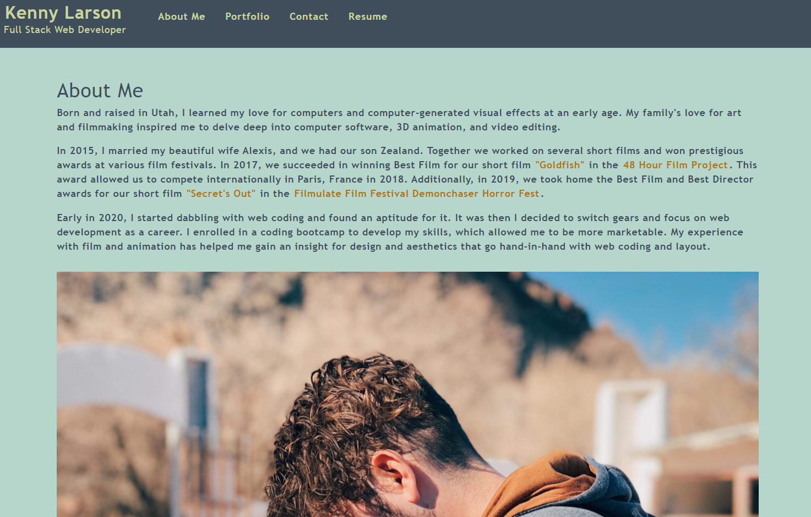

# Portfolio for Kenny Larson

## Description

My portfolio created with React featuring information about me and a gallery of six web development projects.

Link to the deployed application [here](https://kenneththelarson.github.io/portfolio-kenny-larson/)

## Contents

* [Usage](#usage)
* [Built With](#built-with)
* [Questions](#questions)

## Usage

Displays and links to six projects I have worked on for the U of U Coding Bootcamp, the links can be found in the portfolio section. Also displayed is a small about me section along with a photo of myself.

## Built With

* React
* JavaScript
* Node.js
* Express.js

## Questions

Created by: [Kenny Larson](https://github.com/kenneththelarson)

For further question please contact [kenneththelarson@gmail.com](mailto:kenneththelarson@gmail.com)